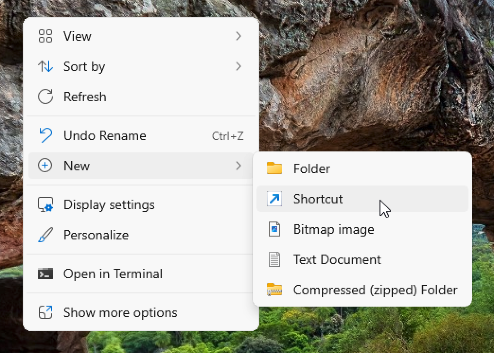
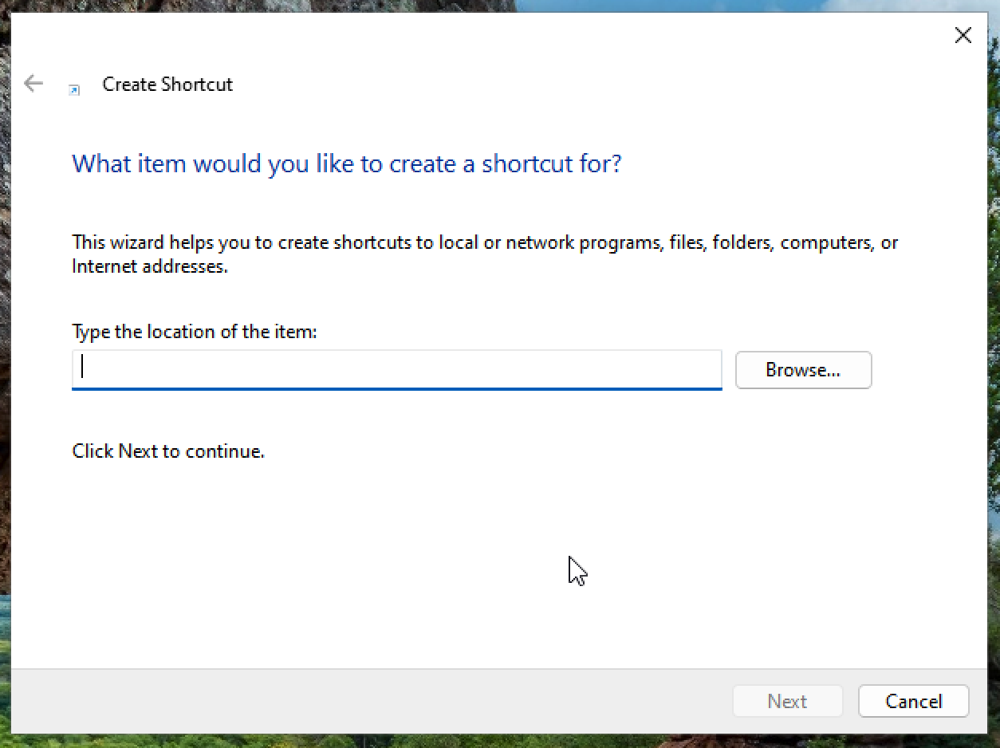
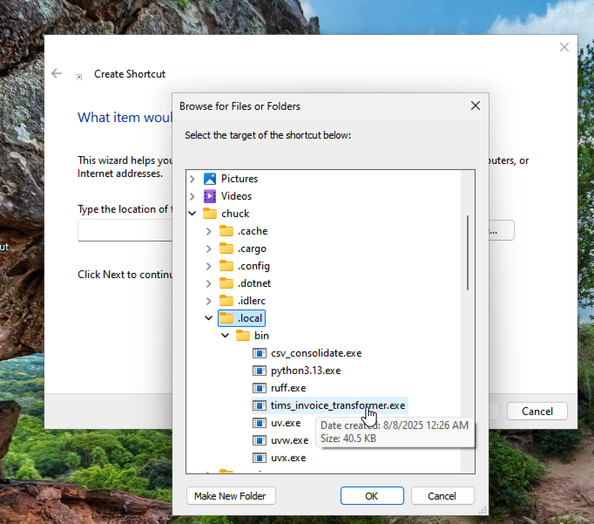
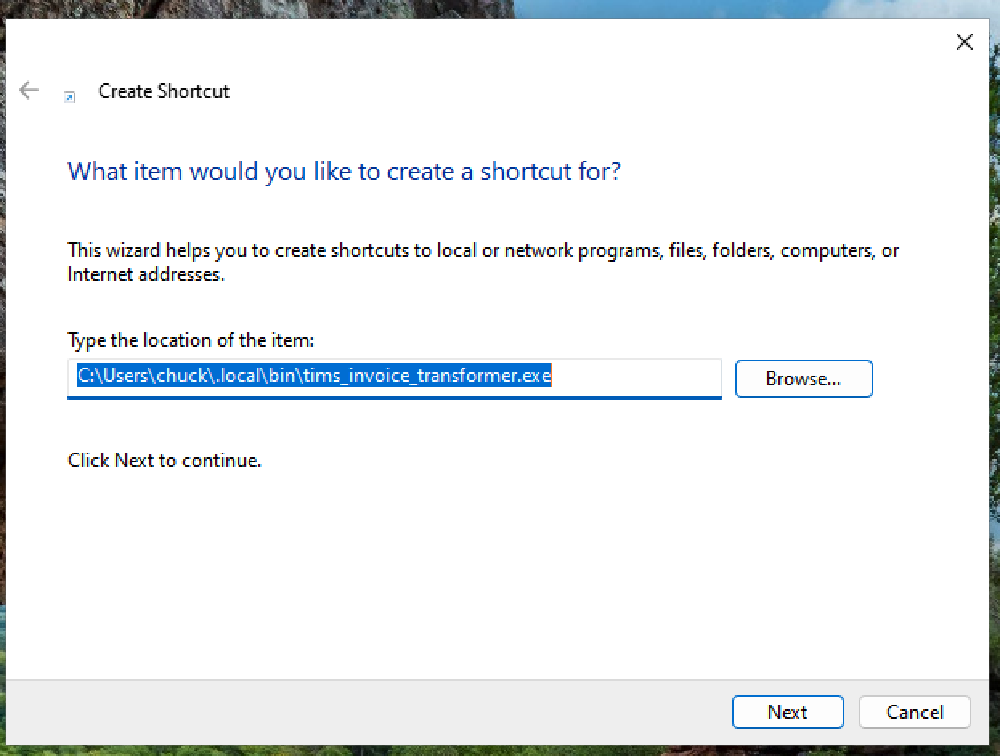
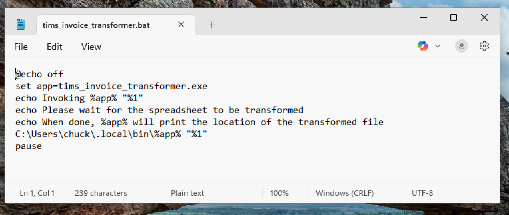
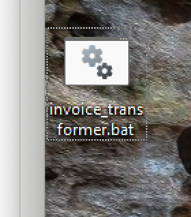
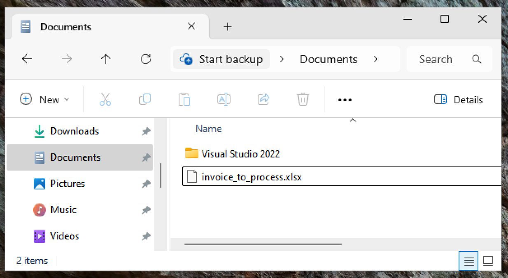
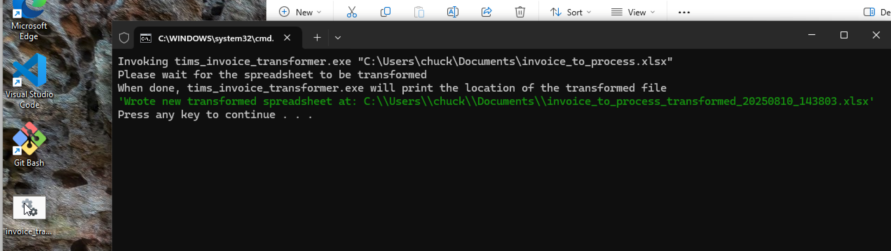
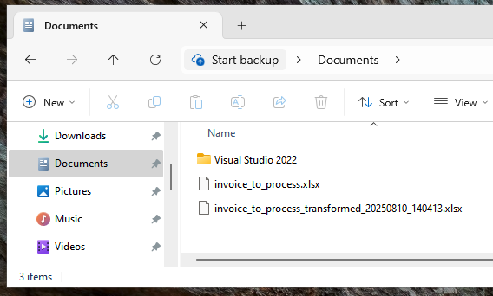

# Windows Explorer Drag to Batch

How to allow Windows File Explorer drag and drop to invoke a CLI app with arguments

## Description

Info showing how to set up a windows batch file to allow file explorer folder/file drag and drop to a command-line interface (CLI) app that needs an argument.

In this case, I will show how to do this to drop a file onto a uv tool install-ed Python entry-point that needs to be passed an argument of the path to the file to process.

The file path will be found using the Windows Explorer application and when found will be dragged onto the desktop icon for the batch file we will create.

That batch file will be passed the droppped file path into the argument %1, which we will use with our code within the batch file.

## Directions

### Create A New Shortcut

On the Windows Desktop, in an empty spot, right click and choose New > Shortcut.

<p align="center"></p>

### Browse to the Program

In the shortcut wizard, browse to the full path of the program you want to run.

<p align="center"></p>

Here, we're going to run a Python program that was installed with `uv tool install` and included an entry-point so it would be installed within a location that is accessible on the user's path. In this case, that path is in the user's folder, under `chuck\.local\bin\` and is named `tims_invoice_transformer.exe`. On your system, if it was uv installed, it'll likely be at `<your-user-name>\.local\bin\` but if not, you'll have to figure out where the `<program-name>.exe` is installed and browse to there.

Once at the right directory location, single click on the exe you want and click `OK`.

<p align="center"></p>

<p style="color: red;">Stop there! Do not finish the shortcut!</p>

Copy the full-path location to the exe from the shortcut wizard.

Once you're completely done, you can just cancel the wizard or delete the shortcut if you went too far.

<p align="center"></p>

### Create a Batch (bat) File

You can download the `invoice_transformer.bat` file in this repository and use it as your starting point, or you can create your own using Notepad.

Either way, use Notepad as the editor so it doesn't add any weird/hidden/magic formatting stuff to your file when you save it, like most other editors.

Here's the content of my bat file:

```ps
@echo off
set app=tims_invoice_transformer.exe
echo Invoking %app% "%1"
echo Please wait for the spreadsheet to be transformed
echo When done, %app% will print the location of the transformed file
C:\Users\chuck\.local\bin\%app% "%1"
pause
```

Now, you can rework your notepad batch file as needed for your situation. In this case, I'll explain how to create the one we have here as the example.

In this case, we are going to reuse parts of the full path in different places in the batch file, so we want to a fragment of it to use as a variable that we can dereference in multiple places.

To do that, we copy just the program.exe name from the text we got from the shortcut wizard and place that after "set app=" in the batch file. This creates the batch file variable `app` that we can dereference later in the batch script with `%app%`.

Note: You use `%1` to dereference the first parameter passed into the batch file by the drop, but you dereference variables you set in the batch file with `%your-var-name%`.

In this example, I am `echo`-ing (printing) information into the CMD terminal the batch file opens to provide status to the user.

Then, in the line that starts with `C:\Users\...`, I am actually calling the program with the full path to the exe and the drop path that was passed in; however, I am dereferencing the exe file name with `%app%` and the drop path with `%1`. Dereferencing means pull out the values from those variables and put them in the line where the dereference occurs, replacing the dereference expression.

So, that `C:` line dereferences to `C:\Users\chuck\.local\bin\tims_invoice_transformer.exe "C:\Users\chuck\Documents\invoice_to_process.xlsx"`. (see below)

Dereferencing happens before the command is called, so the line gets run correctly.

Finally, that `pause` command tells Windows to pause closing the CMD window.

<p align="center"></p>

### Save the Batch File

Save the batch file to your desktop with the .bat file extension and a name that makes sense to you. Here, I chose `invoice_transformer.bat` to make it shorter than the full name of the program so it's easier to see for the drop.

<p align="center"></p>

### Find you File in Explorer

Open Windows Explorer and locate the file you want to process with the application.

Here it's the file called `invoice_to_process.xlsx` (Linux rant: do yourself a favor if you'll be working with command line apps and just go ahead and name your files without spaces, preferably using underscores).

### Drag the File

Now click on that file and drag it (the path) over to the desktop and drop it on the icon of your fresh new batch file and release it.

<p align="center"></p>

### CMD Pops Up

The drop should invoke the batch file, where it will process the variables and call the commands in it. In our case, we send some info (echo) to the user via the CMD window to give them processing info, then we call the program with the dropped argument, then the program we called prints some status info to the CMD window, then the fact that we included `pause` at the end of our batch file makes the CMD window wait and not close until we hit a key. This gives the program time to finish and gives us time to read the status info before the window closes.

<p align="center"></p>

### Confirm Success

For our case, the program we called reads the drop file, reads and transforms the data in the input file, generates a transformed spreadsheet, and writes it into the same folder as the input file. So, if we look in that folder now, we'll see a "tranformed" file.

Sometimes Windows is slow about updating Explorer views, so you can hit `F5` to cause it to refresh quickly if you don't see the new file right away.

<p align="center"></p>

## I hope this info was helpful. Have a good day!
